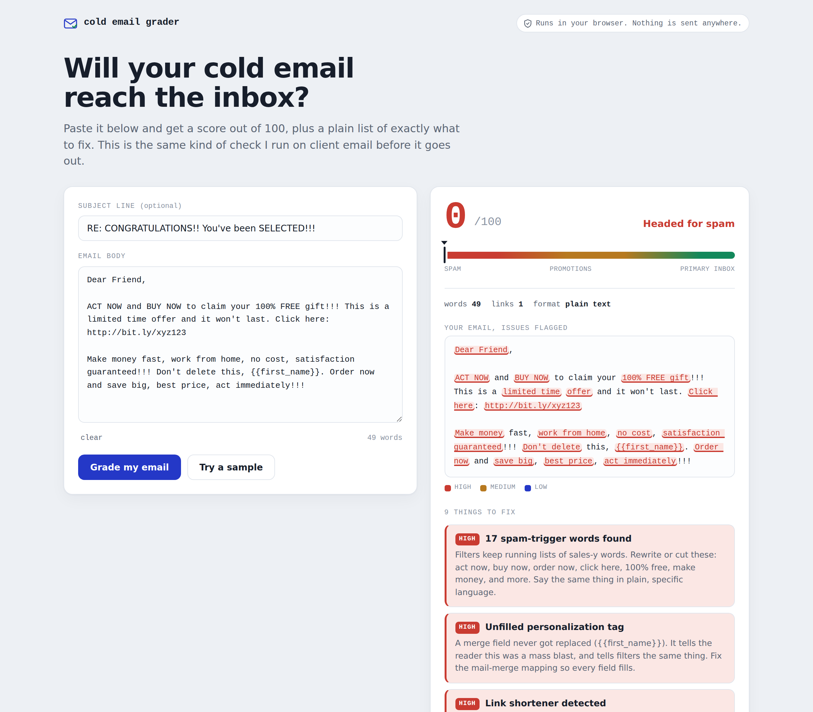

# Cold Email Grader

Paste a cold email and get an inbox score out of 100, plus a plain checklist of
exactly what to fix. It runs fully in your browser. Nothing you paste is sent
anywhere.

<!-- Placeholder: drop a screenshot named screenshot.png in the repo root and it will show up here. -->

## What it checks

The grader reads your subject line and body the way a spam filter would, then
flags the things that tend to keep cold email out of the inbox:

- Spam trigger words and hype phrases, weighted by how strong the signal is
- Unfilled mail-merge tags like `{{first_name}}`, a giveaway of a broken mass send
- Lookalike (homoglyph) characters used to slip past filters
- Link shorteners, too many links, and image-only or hidden-text HTML
- ALL CAPS, exclamation pile-ups, and money or discount symbols
- A missing opt-out, an impersonal greeting, and subject line red flags

## How the score works

Every email starts at 100. Points come off for each signal above, with the
stronger signals costing more. The final number maps to a simple band: inbox
ready, likely lands with some risk, promotions or spam risk, or headed for spam.
The same scoring engine powers both the web page and the tests, so what you see
in the browser is exactly what the tests check.

## What it does not do

This is a content and formatting check only. It does not test your domain
authentication (SPF, DKIM, DMARC) or your sending reputation, which are the
other half of whether mail actually lands.

## Run it locally

No build step and no dependencies.

Open the app by opening `index.html` in any browser.

Or serve it, which helps if your browser is strict about local files:

    python3 -m http.server 8000
    # then visit http://localhost:8000

Run the tests (needs Node):

    node test.js

The tests check four locked cases and print a pass or fail for each. The command
exits with code 0 when everything passes.

## Project layout

- `index.html` is the user interface.
- `engine.js` is the scoring engine, shared by the browser and the tests.
- `test.js` is a small Node test harness with no framework.
- `README.md` is this file.

## Built by

Sourya Bhattarai, email deliverability.

- Website: https://souryabhattarai.com.np
- LinkedIn: https://www.linkedin.com/in/sourya-bhattarai/
